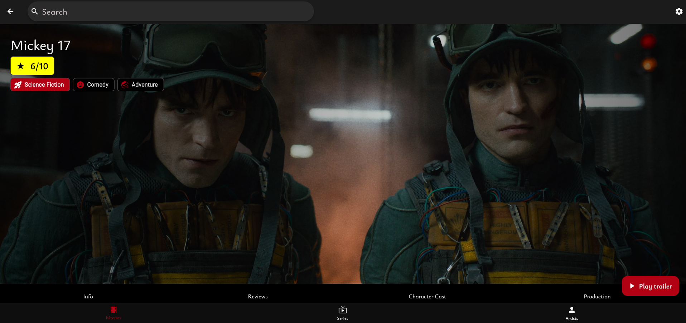
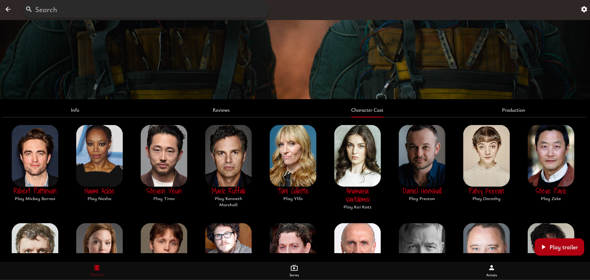

# Film Flu - Your Ultimate Movie & TV Show Companion
Film Flu is a Flutter application designed for movie and TV show enthusiasts. It provides a rich and intuitive experience to discover, explore, and manage your favorite entertainment.

## Features
* **Browse Movies:** Discover a wide range of movies, including trending, popular, upcoming, and top-rated titles.
* **Movie Details:** Access comprehensive information about each movie, including its synopsis, release date, genre, runtime, and user ratings.
* **Cast & Crew:** Explore the talented individuals behind the scenes and in front of the camera, with detailed cast and crew listings.
* **User Authentication:** Securely sign in to personalize your experience.
* **Favorites:** Mark movies and TV shows as favorites to easily track and access them later.
* **Search Functionality:** Quickly find movies, TV shows, or actors using a powerful search bar.
* **Trailer Playback:** Watch high-quality trailers directly within the app to get a sneak peek.
* **Actor/Crew Details:** Dive deeper into the profiles of actors, directors, writers, and other production members, viewing their filmography and biographical information.
* **Browse TV Shows (Future Enhancement):** [Planned] Explore and discover a variety of television series.
* **TV Show Details (Future Enhancement):** [Planned] Access detailed information about TV shows, including seasons, episodes, and air dates.

## Screenshots



## Technologies Used
* **Flutter:** The UI toolkit for building beautiful, natively compiled applications for mobile, web, and desktop from a single codebase.
* **[Add any specific state management solution you used, e.g., Provider, Riverpod, BLoC]**
* **[Add any specific networking library you used, e.g., Dio, http]**
* **[Add any specific image caching library you used, e.g., cached_network_image]**
* **[Add any specific authentication service you used, e.g., Firebase Auth]**
* **[Add any other relevant libraries or services]**

## Getting Started

1.  **Clone the repository:**
    ```bash
    git clone https://www.github.com/dherediat97/FilmFlu
    cd filmflu
    ```

2.  **Install dependencies:**
    ```bash
    flutter pub get
    dart run build_runner build --delete-conflicting-outputs 
    ```

3.  **Configure API Keys (if applicable):**
    * If your app uses an external API for movie data (e.g., TMDB), you might need to obtain an API key and configure it within the project. Refer to the API provider's documentation and look for a configuration file (e.g., `lib/config/api_keys.dart`) or environment variable setup.

4.  **Run the application:**
    ```bash
    flutter run
    ```

## Future Enhancements
* Implement browsing and details for TV shows.
* Add user profile management.
* Implement rating and reviewing system.
* Provide personalized recommendations.
* Explore integration with other movie-related services.
* Implement responsive layout for different screen sizes.
* Add support for different languages.

## Contributing
Contributions are welcome! If you'd like to contribute to the development of Cinephile App, please follow these steps:

1.  Fork the repository.
2.  Create a new branch for your feature or bug fix.
3.  Make your changes and commit them.
4.  Push your changes to your fork.
5.  Submit a pull request.

## License
BSD 3-Clause License

## Contact
[David/FilmFlu]